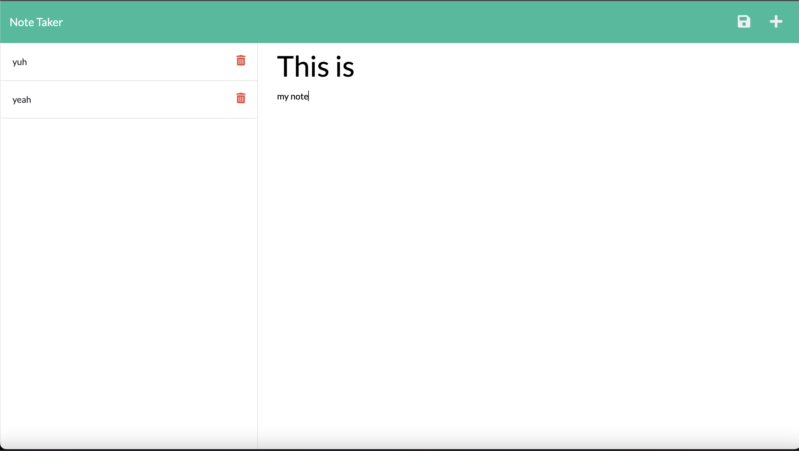

# Note Taker

## Description 
An application based on Express and JS that allows users to write and save notes. 

## Usage

[Live Link](https://teedaa.github.io/note-taker/)

## Languages and Tools Used
* 
* 
* 
* 
* 
* 
* 

## Credits
Pengteda Cheng 
* 
* 
* [Markdown Badges](https://github.com/Ileriayo/markdown-badges)